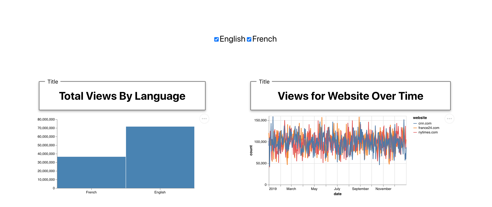

# Challenge

At Predata, we monitor what is happening on the internet. To do so, we track the number of daily views different websites get. To group and relate websites to each other, we assign "tags" to websites. Tags can represent things like a language, a country, or an industry.

We are going to build a service that exposes an API for creating websites and tags, associating tags to websites, and tracking the daily views for a website. To do this, your task is to complete the implementation of a REST interface and an user interface to visualize the data - the frontend runs on `localhost:3000` and will query the flask app for data at `localhost:5000`.

Some starter code has been included in this challenge to give you a place to begin development.

## REST API

Implement:

- api/app/routes.py

To implement the REST interface, fill out the missing code in `api/app/routes.py`. We are using `flask` as our web framework. We are using `SQLAlchemy` with an in-memory `sqlite` database. The database already contains some data and has been provided alongside the code in `website.db`. We will be using `conda` to manage our python dependencies and environment. Use the `website.yml` file to create the python virtual environment by running `conda env create -f website.yml -n website` and `conda activate website`.

To use plain old pip to manage dependencies instead, run `pip install -r requirements.txt`.

To boot the starter code run `FLASK_ENV=development FLASK_APP=api/app/routes.py flask run` on the command line.

Here is the [API specification](api-spec.md) that the web application should conform to.

## User Interface

Below is the user interface we will develop. We are using React as our frontend framework. You will need to fill out javascript functions, implement css and build a react component to complete the UI to spec. **The final product should match the image below.**

First, ensure your `npm` is up to date (`npm install -g npm`) and install the package dependencies: `npm install`.

Then, to run the react app, use `npm start`. The app is served on `http://localhost:3000`.

### Behavior:

- Checkbox:
  - Unchecked: language data filtered from data visualizations
  - Checked: language data shown in data visualizations

### Existing:

- src/App.js
- src/features/chart/line/LineChart.js
- src/features/chart/line/BarChart.js

### Implement:

#### Data Manipulation

- src/features/chart/chartSlice.js (javascript for the bar chart)
  - groupByLanguage

#### CSS

- src/App.module.css (component styling for App.js)
  - time_series\_\_header
  - time_series\_\_chart_row

#### React component

- src/features/chart/ChartHeader (react component to display the title of the charts)
